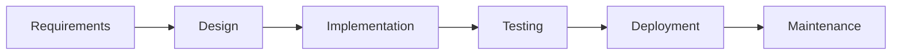
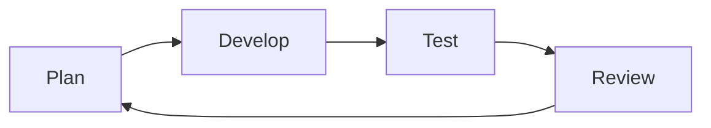
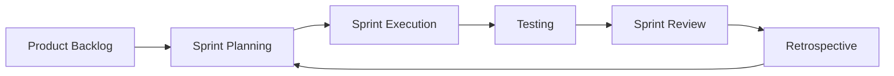
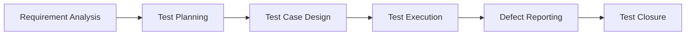

---

# 📘 Module 1: SDLC / STLC

> [!info] 📅 Timeline  
> **Start Date:** 20 March 2026  
> **End Date:** 19 April 2026  
> **Duration:** 30 Days  
> **Goal:** Build a strong foundation in Software Development & Testing Lifecycle

---

## 🎯 Learning Objectives

- Understand SDLC models and their usage
    
- Learn Agile & Scrum workflow
    
- Master STLC phases
    
- Prepare for QA interviews
    

---

# 🔷 1. Waterfall Model

> [!note] Definition  
> The Waterfall Model is a **linear and sequential SDLC model** where each phase is completed before moving to the next.

---

## 🔁 Flow Diagram



---

## 🧠 Key Characteristics

- Sequential process
    
- No phase overlap
    
- Testing happens at the end
    
- Documentation-heavy
    

---

## ✅ Advantages

- Simple and easy to manage
    
- Clear structure
    
- Suitable for small projects
    

---

## ❌ Disadvantages

- Not flexible
    
- Late bug detection
    
- High risk if requirements are wrong
    

---

## 💡 Example

Building a house — each step depends on the previous one.

---

# 🔷 2. Agile Model

> [!note] Definition  
> Agile is an **iterative and flexible SDLC approach** where development and testing happen continuously.

---

## 🔁 Iteration Cycle



---

## 🧠 Key Characteristics

- Continuous feedback
    
- Incremental delivery
    
- Parallel testing & development
    

---

## ✅ Advantages

- Flexible and adaptive
    
- Early bug detection
    
- Faster delivery
    

---

## ❌ Disadvantages

- Requires strong collaboration
    
- Less documentation
    
- Can be confusing initially
    

---

## 💡 Example

Building an app step-by-step with continuous improvements.

---

# 🔷 3. Scrum Framework

> [!note] Definition  
> Scrum is a framework under Agile that uses **Sprints (2–4 weeks)** to deliver work.

---

## 🔁 Scrum Workflow



---

## 👥 Roles

- **Product Owner** → Defines requirements
    
- **Scrum Master** → Manages process
    
- **Development Team** → Builds & tests
    

---

## 🧠 Key Concepts

- Sprint
    
- Daily Standup
    
- Sprint Review
    
- Retrospective
    

---

## ✅ Advantages

- Fast delivery
    
- Continuous improvement
    
- Clear workflow
    

---

## ❌ Disadvantages

- Needs experienced team
    
- Poor management can cause failure
    

---

# 🔷 4. Testing Phases (STLC)

> [!note] Definition  
> STLC defines the **step-by-step process of software testing**.

---

## 🔁 STLC Flow



---

## 🧠 Phase Breakdown

### 🔹 Requirement Analysis

- Understand requirements
    
- Identify test scenarios
    

### 🔹 Test Planning

- Define strategy, tools, timeline
    
- Resource allocation
    

### 🔹 Test Case Design

- Write test cases
    
- Prepare test data
    

### 🔹 Test Execution

- Execute test cases
    
- Mark Pass/Fail
    

### 🔹 Defect Reporting

- Log bugs
    
- Track and retest
    

### 🔹 Test Closure

- Final report
    
- Lessons learned
    

---

> [!tip] 🎯 Key Insight  
> Testing starts from **Requirement Analysis**, not execution.

---

# ⚡ Quick Revision

|Topic|Summary|
|---|---|
|Waterfall|Linear, rigid, late testing|
|Agile|Flexible, continuous testing|
|Scrum|Agile with sprints|
|STLC|Testing lifecycle|

---

# 🚀 End Goal

By **19 April 2026**, you should:

- Explain SDLC models confidently
    
- Understand Agile & Scrum clearly
    
- Know complete STLC flow
    
- Be interview-ready
    

---

# 📌 Next Step

👉 SDLC vs STLC

---

## ⚠️ Why your previous version looked wrong

- You pasted **inside a code block (```)**
    
- Or Obsidian didn’t render Mermaid / callouts
    

---

## ✅ Fix (very important)

1. Paste **normally (not inside ``` block)**
    
2. Enable:
    
    - Settings → **Editor → Enable Live Preview**
        
    - Settings → **Core Plugins → Turn ON “Mermaid”**
        

---

If you want, next I can:

- Add **daily tracker (Day 0 → Day 30 progress)**
    
- Or convert this into a **linked Obsidian vault system (pro level setup)**