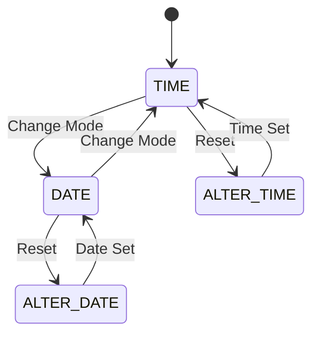

---
# 🔷 State Transition Testing

> [!note] Definition  
> State Transition Testing is a **black-box testing technique** used to verify how a system behaves when it transitions from one **state to another** based on different inputs or events.

---

## 🧠 Key Concept

- System exists in **different states**
    
- Input/event causes **state change (transition)**
    
- Testing focuses on:
    
    - Valid transitions ✅
        
    - Invalid transitions ❌
        
    - Sequence of events
        

---

# 🔁 State Transition Flow

---

# 📌 Core Components

- **State** → Current condition (e.g., TIME, DATE)
    
- **Transition** → Movement between states
    
- **Event/Input** → Trigger for transition
    
- **Action** → Result of transition
    

---

# 🎯 Objectives

- Identify all possible **system states**
    
- Verify **correct state transitions**
    
- Validate **initial and final states**
    
- Check **error handling & recovery**
    

---

# ⚙️ Example (Watch System)

|Current State|Input|Next State|
|---|---|---|
|TIME|Change Mode|DATE|
|DATE|Change Mode|TIME|
|TIME|Reset|ALTER TIME|
|DATE|Reset|ALTER DATE|
|ALTER TIME|Time Set|TIME|
|ALTER DATE|Date Set|DATE|

---

# 🧪 Where to Use

- Login systems (valid/invalid login attempts)
    
- ATM machines
    
- Online transactions
    
- Workflow-based systems
    
- UI navigation systems
    

---

# ✅ Advantages

- Clear visualization of system behavior
    
- Helps design effective test cases
    
- Early detection of transition-related bugs
    
- Improves system reliability
    

---

# ❌ Disadvantages

- Hard to identify all states in complex systems
    
- May miss combination scenarios
    
- Risk of incomplete coverage
    

---

# 🎯 Key Insight

> This technique is best when **output depends on current state + input sequence**

---

# ⚡ Quick Revision

|Concept|Meaning|
|---|---|
|State|Current condition|
|Transition|Change between states|
|Focus|Sequence-based behavior|
|Use Case|Workflow systems|

---

# 🔗 Related Notes

- [[Boundary Value Analysis (BVA)]]
    
- [[State_Transition]]
    
- [[Decision_Table]]
    
- [[EP]]
---