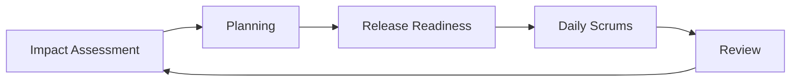
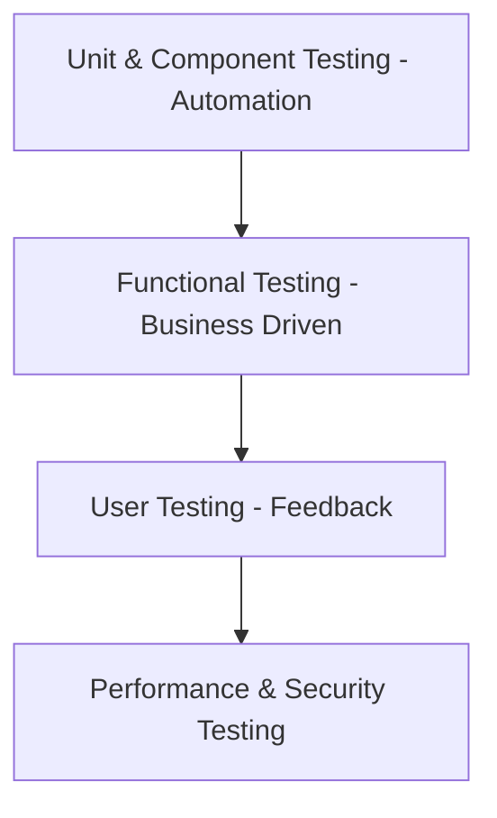

---

# 🔷 Agile Testing

> [!note] Definition  
> Agile Testing is a **software testing approach that follows Agile principles**, where testing is performed **continuously alongside development** with the goal of **early feedback and customer satisfaction**.

---

## 🧠 Key Concepts

- Testing is **not a separate phase**
    
- Happens in **every iteration (sprint)**
    
- Involves **developers, testers, and stakeholders**
    
- Focus on **customer needs & fast feedback**
    

---

## 🔑 Core Principles

- **Continuous Feedback** → Faster bug fixing, reduced cost
    
- **Parallel Testing** → Testing + development happen together
    
- **Team Collaboration** → Everyone is involved
    
- **Lightweight Documentation** → Focus on essentials
    
- **Clean Code** → Bugs fixed in same iteration
    
- **Customer-Centric** → Requirements can evolve anytime
    

---

## ⚙️ Key Features

- Simple and focused testing
    
- Continuous improvement through feedback
    
- Self-organized teams
    
- Strong communication
    
- Frequent feedback cycles
    

---

# 🔁 Agile Testing Lifecycle

---

## 📌 Phases Explained

### 🔹 Impact Assessment

- Collect feedback from users/stakeholders
    
- Define next goals
    

### 🔹 Planning

- Define test strategy, schedule, resources
    

### 🔹 Release Readiness

- Check if features are ready for release
    

### 🔹 Daily Scrums

- Daily updates on progress
    

### 🔹 Review

- Evaluate performance and improvements
    

---

# 🔁 Agile Testing Strategies

## 1. Iteration 0 (Setup Phase)

- Define scope, risks, resources
    
- Setup test environment
    

---

## 2. Construction Iteration (Main Work)

### ✔ Confirmatory Testing

- Verifies requirements
    
- Includes:
    
    - Acceptance Testing
        
    - Unit + Integration Testing
        

### ✔ Investigative Testing

- Finds missed bugs
    
- Includes:
    
    - Load, Security, Stress testing
        

---

## 3. Release End Game

- Final testing
    
- User acceptance
    
- Documentation & deployment prep
    

---

## 4. Production

- Final product released
    
- Monitor and fix issues
    

---

# 🧪 Agile Testing Methodologies

### 🔹 TDD (Test-Driven Development)

- Write test → Write code → Refactor
    

### 🔹 BDD (Behavior-Driven Development)

- Focus on user behavior
    

### 🔹 ATDD

- Collaboration between customer + dev + tester
    

### 🔹 Exploratory Testing

- No predefined test cases (creative testing)
    

### 🔹 XP (Extreme Programming)

- Frequent releases, high quality
    

### 🔹 Session-Based Testing

- Time-boxed testing sessions
    

---

# 🧩 Agile Testing Quadrants

---

## 📌 Quadrants Summary

- **Q1:** Unit & component testing (automation)
    
- **Q2:** Functional testing (manual + automation)
    
- **Q3:** Usability & UAT (manual)
    
- **Q4:** Performance, security (tools-based)
    

---

# 📄 Agile Test Plan Includes

- Test scope
    
- Tools & environment
    
- Strategy & approach
    
- Resources
    
- Risks & mitigation
    
- Performance testing plan
    

---

# ✅ Advantages

- Faster delivery
    
- Early bug detection
    
- Better product quality
    
- High customer satisfaction
    
- Flexible to changes
    

---

# ❌ Limitations

- Less documentation
    
- Requires skilled team
    
- Difficult to estimate cost/time
    
- Frequent changes can introduce bugs
    

---

# ⚠️ Challenges

- Changing requirements
    
- Incomplete test coverage
    
- Lack of skilled testers
    
- Performance issues
    
- Skipping non-functional tests
    

---

# 🚨 Risks

- Slow UI automation
    
- Poor test planning
    
- Unstable automated tests
    
- Lack of expertise
    

---

# ⚡ Quick Revision

|Topic|Key Idea|
|---|---|
|Agile Testing|Continuous testing with development|
|Focus|Customer satisfaction|
|Approach|Iterative & flexible|
|Strength|Fast feedback|
|Weakness|Less documentation|

---

# 🔗 Related Notes

##### - [[Agile]]
##### - [[Scrum]]
##### - [[SDLC]]
##### - [[Testing_Phases]]

---
