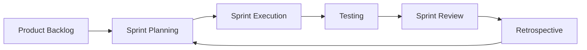

# 🔷 Scrum Testing

> [!note] Definition  
> Scrum Testing is a **testing approach performed within the Scrum framework**, where testing is integrated into each sprint to ensure continuous quality and fast feedback.

---

## 🧠 Key Concept

- Testing happens **in every sprint**
    
- No separate testing phase
    
- Strong **team collaboration**
    
- Focus on **continuous improvement**
    

---

# 🔁 Scrum Workflow

---

# 🎯 Objectives

- Ensure **software quality**
    
- Detect bugs early
    
- Validate **performance & usability**
    
- Support continuous delivery
    

---

# 🔑 Key Attributes

## 🔹 1. Project Goals

- Define requirements and objectives
    
- Ensure product meets user needs
    

---

## 🔹 2. Product Backlog

- List of all features (user stories)
    
- Managed by **Product Owner**
    

---

## 🔹 3. Sprint Backlog

- Tasks selected for current sprint
    
- Managed by **development team**
    

---

# ⚙️ Characteristics

- Iterative process (repeated cycles)
    
- Fixed sprint duration (2–4 weeks)
    
- Continuous testing
    
- Depends on team collaboration
    

---

# 👥 Roles in Scrum Testing

- **Product Owner** → Defines requirements
    
- **Scrum Master** → Facilitates process
    
- **Development Team (incl. Testers)** → Builds & tests
    

> [!tip] Testers are not separate—they are part of the team.

---

# ✅ Advantages

- Early defect detection
    
- Continuous feedback
    
- Faster delivery
    
- Better product quality
    
- Strong collaboration
    
- Flexible to changes
    

---

# ❌ Disadvantages

- Requires constant communication
    
- Difficult for large projects
    
- Needs skilled team
    
- Less long-term planning
    
- Can slow development if mismanaged
    

---

# ⚠️ Challenges

- Managing changing requirements
    
- Coordination between team members
    
- Maintaining test coverage
    
- Balancing speed vs quality
    

---

# 🎯 Key Insight

> In Scrum, **testing is continuous and integrated**, not a final phase.

---

# ⚡ Quick Revision

|Topic|Key Idea|
|---|---|
|Scrum Testing|Testing in sprints|
|Focus|Continuous quality|
|Strength|Fast feedback|
|Weakness|Needs strong team|

---

# 🔗 Related Notes

- [[Agile Testing]]
    
- [[Waterfall Model]]
    
- [[Software Testing Life Cycle (STLC)]]
    
- [[SDLC]]
    

---
