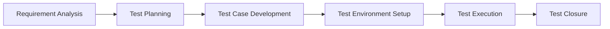

---

# 🔷 Software Testing Life Cycle (STLC)

> [!note] Definition  
> STLC is a **structured process to verify and validate software quality**, ensuring the product meets user expectations.

---

## 🧠 Key Concept

- STLC is a **part of SDLC**
    
- Focuses only on **testing activities**
    
- Ensures **quality, reliability, and defect-free software**
    

---

# 🔁 STLC Flow

---

# 📌 STLC Phases

## 🔹 1. Requirement Analysis

- Understand requirements (SRD)
    
- Identify test scenarios
    
- Detect missing or unclear requirements
    
- Identify risks
    

---

## 🔹 2. Test Planning

- Define **test strategy & scope**
    
- Select tools and resources
    
- Estimate time & cost
    
- Assign roles
    

> [!tip] ⭐ Most Important Phase (Interview Favorite)

---

## 🔹 3. Test Case Development

- Write clear test cases
    
- Prepare test data
    
- Define expected results
    
- Maintain RTM
    

---

## 🔹 4. Test Environment Setup

- Setup tools, servers, browsers
    
- Configure system
    
- Validate environment
    

---

## 🔹 5. Test Execution

- Execute test cases
    
- Log defects (severity & priority)
    
- Retesting & regression testing
    
- Analyze results
    

---

## 🔹 6. Test Closure

- Prepare test summary report
    
- Ensure all defects are closed
    
- Document learnings
    
- Archive test data
    

---

# ⚡ STLC vs SDLC

|Aspect|SDLC|STLC|
|---|---|---|
|Definition|Full development process|Testing process only|
|Focus|Build software|Test software|
|Phases|Dev + Testing + Deployment|Only testing phases|
|Performed By|Dev + QA + PM|QA team|
|Output|Final product|Test reports|
|Relation|Complete lifecycle|Part of SDLC|

---

# 🎯 Key Insight

> STLC runs **parallel to SDLC**, not after it.

---

# ⚡ Quick Revision

|Phase|Purpose|
|---|---|
|Requirement Analysis|What to test|
|Test Planning|How to test|
|Test Case Dev|Design tests|
|Environment Setup|Prepare system|
|Execution|Run tests|
|Closure|Final report|

---

# 🔗 Related Notes

- [[Agile Testing]]
    
- [[Waterfall Model]]
    
- [[Software Testing Life Cycle (STLC)]]
    
- [[SDLC]]
    
---