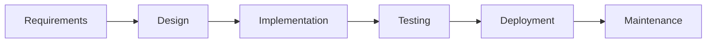

# 🌊 Waterfall Model

> [!info] Definition  
> The **Waterfall Model** is a traditional software development methodology that follows a **linear, sequential approach**, where each phase must be completed before moving to the next.
> 
> It **does not allow backtracking** and supports only minimal changes once a phase is completed.

---

## 🧠 Overview

|Attribute|Description|
|---|---|
|Type|Linear SDLC Model|
|Flexibility|Low|
|Risk Handling|Predictable|
|Best For|Stable & well-defined projects|

---

## ⚙️ Key Features

> [!abstract] Core Characteristics

- 🔁 **Sequential Approach**  
    Step-by-step execution (no overlap between phases)
    
- 📄 **Document-Driven Process**  
    Heavy documentation (SRS, SDD)
    
- ✅ **Quality Control**  
    Strong validation at each stage
    
- 📊 **Detailed Planning**  
    Clear scope, timeline, deliverables
    

---

## 🔄 Waterfall Flow (Mermaid Diagram)



---

## 🏗️ Phases of Waterfall Model

---

### 1️⃣ Requirements Analysis & Specification

> [!note]  
> Focus: Understanding and documenting user needs

- Requirement Gathering
    
- Requirement Analysis
    
- SRS Documentation (Software Requirement Specification)
    

---

### 2️⃣ Design

> [!tip]  
> Converts requirements into system architecture

**Types of Design:**

- 🏢 **HLD (High-Level Design)** → Architecture & modules
    
- 🔧 **LLD (Low-Level Design)** → Logic & data flow
    

📄 Output: **SDD (Software Design Document)**

---

### 3️⃣ Development

> [!example]  
> Actual coding phase

- Code implementation
    
- Module-wise development
    
- Unit Testing
    

---

### 4️⃣ Testing & Deployment

> [!warning]  
> Ensures system works correctly before release

#### 🧪 Testing Types

- Alpha Testing (Internal)
    
- Beta Testing (Users)
    
- Acceptance Testing (Client)
    

#### 🚀 Deployment

- Live environment setup
    
- User training
    
- Final validation
    

---

### 5️⃣ Maintenance

> [!success]  
> Post-release support and updates

|Type|Description|
|---|---|
|🔴 Corrective|Fix bugs|
|🟡 Perfective|Improve features|
|🔵 Adaptive|Support new systems|

---

## ✅ Advantages

> [!success] Why Use Waterfall?

- Easy to understand
    
- Clear structure
    
- Strong documentation
    
- Defined milestones
    
- Encourages discipline
    
- Ideal for stable projects
    

---

## ⚠️ When to Use Waterfall Model

> [!hint]

- ✔️ Requirements are fixed
    
- ✔️ Minimal changes expected
    
- ✔️ Small to medium projects
    
- ✔️ Low risk
    
- ✔️ Regulatory projects
    
- ✔️ Limited resources
    

---

## ❌ Limitations (Important for Interviews)

> [!failure]

- No flexibility
    
- Late testing phase
    
- Difficult to handle changes
    
- Not suitable for complex projects
    

---

## 🍔 Real-World Example: Online Food Delivery System

> [!example] Scenario-Based Understanding

### 🔍 1. Analysis

- User registration
    
- Restaurant listing
    
- Order system
    
- Payment & tracking
    

---

### 🎨 2. Design

- App architecture
    
- Database design
    
- UI/UX layout
    
- Payment integration
    

---

### 💻 3. Implementation

- Login module
    
- Order processing
    
- Notifications
    

---

### 🧪 4. Testing

- Order placement testing
    
- Payment validation
    
- Performance testing
    

---

### 🔧 5. Maintenance

- Add restaurants
    
- Improve tracking
    
- Update security
    

---

## 🧩 Pro Tips (For Your Notes System)

> [!tip]

- Use **Tags**:
    
    ```
    #SDLC #Waterfall #SoftwareTesting
    ```
    
- Create backlinks:
    
    ```
    [[SDLC Models]]
    [[Agile Model]]
    ```
    
- Add this for navigation:
    
    ```
    ## 📌 Related Notes
    - [[Agile Model]]
    - [[V Model]]
    ```
    

---
